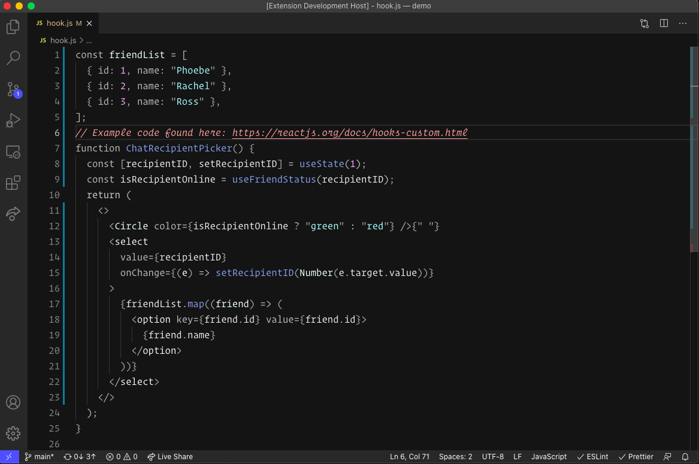

# Selenian 🌒
A Visual Studio Code theme that draws inspiration from the earth's lunar companion, the Moon. 

## Details
Selenian is a minimal dark theme that uses gray tones combined with sparse colors to allow for easier code scanning, while not overwhelming the user with color. You will notice that more common aspects of code are shades of gray, whereas tokens like functions, strings, constants, comments, etc. are brought to life with color to make them stand out when scanning code.

### Attributions
---
- Sarah Drasner (author of [Night Owl](https://github.com/sdras/night-owl-vscode-theme)) posted this [article](https://css-tricks.com/creating-a-vs-code-theme/), which gave me everything I needed to create this theme (and more!).
- Inspired by Nikita Prokopov's [Alabaster](https://github.com/tonsky/vscode-theme-alabaster) theme.
